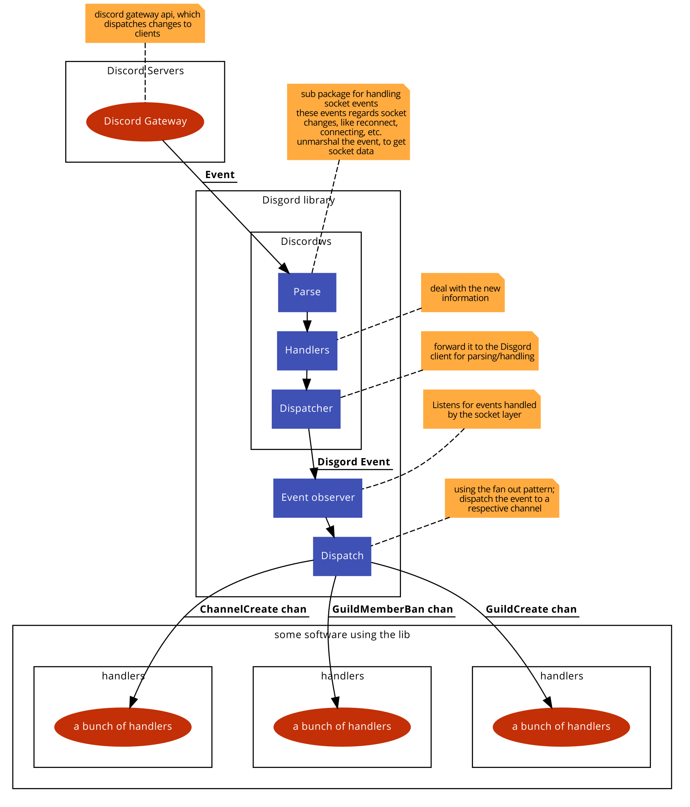

# Disgord

[](https://circleci.com/gh/andersfylling/disgord/tree/master)[](https://codeclimate.com/github/andersfylling/disgord/maintainability) [](https://codeclimate.com/github/andersfylling/disgord/test_coverage) [](https://coveralls.io/github/andersfylling/disgord)

## About
This library is split into three parts: caching, requests and events.
Disgord is currently under heavy development and should not be used for production. Contributions are welcome.

Objects will have methods to simplify interaction: `User.sendMsgStr(...)`, or `Channel.SendMsgStr(...)`.


#### Caching
The cache, of discord objects, aims to reflect the same state as of the discord servers. Therefore incoming data is deep copied, as well as return values from the cache.
This lib handles caching for you, so whenever you send a request to the REST API or receive a discord event. The contents are cached auto-magically to a separate memory space.

#### Requests
For every REST API request (which is the only way to get objects from the discord interface, without waiting for changes as events) the request is rate limited auto-magically by the library (caching coming soon for resource funcs).
The functions in `resource` pkg are blocking, and should be used with care. For async requests, use the methods found at the `Session` interface, such as:
`Session.User(userID)` which returns a channel. The channel will get content from the REST API, if not found in the cache.

#### Events
The reactor pattern with goroutines, or a pro-actor pattern is used. This will always be the default behavior, synchronous triggering of listeners might be implemented in the future.
Incoming events from the discord servers are parsed into respective structs and dispatched to either a) callbacks, or b) through channels. Both are dispatched from the same place, and the arguments share the same memory space. So it doesn't matter which one you pick, chose your preference.

## Quick example

```go
package main

import (
    "os"
    "os/signal"
    "syscall"

    "github.com/andersfylling/disgord"
    "github.com/sirupsen/logrus"
)

func main() {
    termSignal := make(chan os.Signal, 1)
    signal.Notify(termSignal, syscall.SIGINT, syscall.SIGTERM, os.Interrupt, os.Kill)

    sess, err := disgord.NewSession(&disgord.Config{
        Token: os.Getenv("DISGORD_TOKEN"),
    })
    if err != nil {
        panic(err)
    }

    // add a event listener
    sess.AddListener(event.GuildCreateKey, func(session Session, box *event.GuildCreateBox) {
        guild := box.Guild
        // do something with guild
    })

    // or use a channel to listen for events
    go func() {
        for {
            select {
            case box, alive := <- sess.Evt().GuildCreateChan():
                if !alive {
                    fmt.Println("channel is dead")
                    break
                }

                guild := box.Guild
                // do something with guild
            }
        }
    }()

    // retrieve a specific user from the Discord servers
    userID := snowflake.NewID(228846961774559232)
    user := <- sess.User(userID) // sends a request to discord
    user2 := <- sess.User(userID) // does a cache look up, to prevent rate limiting/banning

    // connect to the discord gateway to receive events
    err = sess.Connect()
    if err != nil {
        panic(err)
    }

    <-termSignal
    sess.Disconnect()
}
```

Output:

```
╰─ go build && ./disgordtest
INFO[2018-02-16 19:05:47] Connecting to discord Gateway                 lib="Disgord v0.0.0"
INFO[2018-02-16 19:05:48] Connected                                     lib="Disgord v0.0.0"

```

Then on a system interrupt, here pressing `Ctrl+C`, you will see the following:

```
^C
INFO[2018-02-16 19:07:28] Closing Discord gateway connection            lib="Disgord v0.0.0"
INFO[2018-02-16 19:07:30] Disconnected                                  lib="Disgord v0.0.0"
```

## Code flow

The main design takes in a discord event and dispatches the event to a channel/callback suited for the event type. The channel can be retrieved and the callbacks set by the Session interface: `Session.Event.ChannelDeleteChan()`, `Session.Event.AddHandler(event.GuildCreateKey, func(...){})` 

Note that callbacks and channels are fired from the same place, to avoid overhead. However, channels are fired before the callbacks.

## Q&A

```Markdown
1. Reason for making another Discord lib in GoLang?

I'm trying to take over the world and then become a intergalactic war lord. Have to start somewhere.
```

## Thanks to
* [github.com/s1kx](https://github.com/s1kx)

## Progress

[Progression for different Discord implementations](PROGRESS.md)
